<div align="center">




[](https://github.com/Thibautdqb)
[](mailto:thibautdqb@gmail.com)
[](https://artdepercevoir.com)


</div>

<table>
<tr>
<td width="52%" valign="top">

<pre>
┌─ thibaut.dqb ──────────────────────┐
│                                    │
│   DATA  ──►  MODELS  ──►  IMPACT  │
│     │          │           │       │
│   clean      reason      ship      │
│                                    │
│   AI  ×  QUANT  ×  ENGINEERING     │
└────────────────────────────────────┘
</pre>

**AI Engineer, Quantitative Analyst & Tech Lead** based in France.

I build systems that move from messy real-world data to models, decisions and production tools.

`Double Master's` **AI & Big Data** + **Finance**  
`Languages` English C1+ · Spanish B1+

</td>
<td width="48%" valign="top">

### `now()`

**Espace Blanc — AI Engineer**  
Computer vision, local LLM valuation, PostgreSQL/Supabase workflows and automated reporting.

**artdepercevoir — Tech Lead**  
Full-stack architecture, Docker/CI/CD infrastructure, Cloudflare R2 and real-time analytics.

**Quant research lab**  
Volatility regimes, 13F intelligence, earnings IV vs RV, screening and P&L monitoring.

</td>
</tr>
</table>

<div align="center">

### `toolbox`


</div>

<table>
<tr>
<td width="33%" valign="top">

### `01 / AI systems`

- Computer vision pipelines
- Local LLM workflows
- Role-based applications
- Structured PDF reporting

</td>
<td width="34%" valign="top">

### `02 / Quant research`

- Volatility regime models
- 13F institutional tracking
- Earnings volatility analysis
- Portfolio & execution analytics

</td>
<td width="33%" valign="top">

### `03 / Data platforms`

- Automated ETL pipelines
- PostgreSQL architectures
- Data quality & validation
- APIs, dashboards and CI/CD

</td>
</tr>
</table>

### `experience.log`

```text
2026 → now   AI Engineer · Espace Blanc          AI inventory and valuation platform
2026 → now   Tech Lead · artdepercevoir           Product architecture and infrastructure
2025 → 2026  Quant Analyst · Tiepolo              Research engines and market-data pipelines
2024          Data Analyst · Safran                ETL, PostgreSQL and BI optimization
2023          BI Data Analyst · EuroLeague         Automation and market intelligence
```

<div align="center">

### `github.signal`


<details>
<summary><strong>open the extended activity feed</strong></summary>
<br/>

</details>

</div>

<table>
<tr>
<td width="55%" valign="top">

### `selected modules`

```text
├── 13f-intelligence-tracker
├── volatility-regime-engine
├── earnings-iv-vs-rv-analyzer
├── portfolio-and-pnl-monitor
├── execution-cost-dashboard
└── automated-morning-meeting
```

</td>
<td width="45%" valign="top">

### `outside the terminal`

`rugby` · `snowboard` · `surf`  
`kitesurf` · `climbing` · `photography`

> Build useful things. Measure what matters.

</td>
</tr>
</table>

<div align="center">

### `contribution loop`

<picture>
  <source media="(prefers-color-scheme: dark)" srcset="https://raw.githubusercontent.com/Thibautdqb/Thibautdqb/output/github-contribution-grid-snake-dark.svg" />
  <source media="(prefers-color-scheme: light)" srcset="https://raw.githubusercontent.com/Thibautdqb/Thibautdqb/output/github-contribution-grid-snake.svg" />
  
</picture>

<br/>

[](mailto:thibautdqb@gmail.com)

<sub>AI × finance × engineering — built with curiosity and production discipline.</sub>

</div>
